# **プロジェクトのセットアップ**

---
hideInToc: true
transition: slide-up
---

# プロジェクトの作成
<div/>

作成コマンド👇

https://hono.dev/docs/#quick-start

```sh
npm create hono@latest
```


---
transition: slide-up
---

### プロジェクトのフォルダを開く

```sh
cd my-app && code .
```


---
transition: slide-up
---

### ``src/index.ts`` を開く


---
transition: slide-up
---

### 起動してみる

```sh
pnpm run dev
```


``Server is running on http://localhost:3000`` というメッセージが出力されるのを確認！

---

``src/index.ts``

```ts {14}{lines:true}
import { serve } from '@hono/node-server'
import { Hono } from 'hono'

const app = new Hono()

app.get('/', (c) => {
  return c.text('Hello Hono!')
})

serve({
  fetch: app.fetch,
  port: 3000
}, (info) => {
  console.log(`Server is running on http://localhost:${info.port}`)
})
```

14行目の``console.log``で起動時にAPIサーバーのURLを出力している。

---
hideInToc: true
transition: slide-up
---

# ブラウザで開いてみよう

http://localhost:3000


---

``src/index.ts``

```ts {6-8}{lines:true}
import { serve } from '@hono/node-server'
import { Hono } from 'hono'

const app = new Hono()

app.get('/', (c) => {
  return c.text('Hello Hono!')
})

serve({
  fetch: app.fetch,
  port: 3000
}, (info) => {
  console.log(`Server is running on http://localhost:${info.port}`)
})
```

6-8行目でリクエストの処理を行っている。

---
hideInToc: true
transition: slide-up
---

# エンドポイントを追加する

**エンドポイントとは？**

エンドポイントは、APIサーバーがクライアントからのリクエストを受け取るURLパスのこと。

- `app.get('/', ...)` → `GET /` へのリクエストを処理
- `app.post('/users', ...)` → `POST /users` へのリクエストを処理
- `app.put('/users/:id', ...)` → `PUT /users/123` のようなリクエストを処理

各エンドポイントは特定のHTTPメソッド（GET、POST、PUT、DELETEなど）とパスの組み合わせで定義される。

---
transition: slide-up
---

`/ping` にアクセスすると `pong!` と返ってくるようにする

`src/index.ts`
````md magic-move
```ts {*}{lines:true}
import { serve } from '@hono/node-server'
import { Hono } from 'hono'

const app = new Hono()

app.get('/', (c) => {
  return c.text('Hello Hono!')
})

serve({
  fetch: app.fetch,
  port: 3000
}, (info) => {
  console.log(`Server is running on http://localhost:${info.port}`)
})
```

```ts {10-12}{lines:true}
import { serve } from '@hono/node-server'
import { Hono } from 'hono'

const app = new Hono()

app.get('/', (c) => {
  return c.text('Hello Hono!')
})

app.get('/ping', (c) => {
  return c.text('pong!')
})

serve({
  fetch: app.fetch,
  port: 3000
}, (info) => {
  console.log(`Server is running on http://localhost:${info.port}`)
})
```
````

---

### 反映されているか確認

http://localhost:3000/ping


``curl`` コマンドでも確認できます

```sh
curl http://localhost:3000/ping
```


---
layout: section
---

# データベースに触れてみる
SQLiteを触ってみよう

---
hideInToc: true
---

# 色々なデータベース

- **リレーショナル**: MySQL, PostgreSQL, SQLite
- **NoSQL**: MongoDB, Redis

(<Link to="9">ここ</Link>でも言ったやつ)

<div class="mt-20"/>

## 今日はSQLiteを使いますよ

---
hideInToc: true
---

# SQLite
<div/>

## 扱いやすい

MySQLとかはサーバー上で動かすが，SQLiteはファイルひとつに集約される。

<div class="mt-10"/>

---
hideInToc: true
---

# SQLiteをインストールする

### Mac
```bash
brew install sqlite
```

### Windows
```bash
winget install sqlite.sqlite

```

### Linux
各ディストリビューションごとに対応してください。 <span class="opacity-20">投げやり</span>
 
Ubuntuの場合👇

```bash
sudo apt install sqlite3

```

---
hideInToc: true
transition: slide-up
---

# データベースを操作してみよう
<div/>

<v-click>

1. データベースに入る
```bash
sqlite3 sample.db
```

</v-click>

<v-click>

2. テーブルを作ってみる (最後の`;`を忘れずに)
```sql
create table users (id INTEGER PRIMARY KEY, name TEXT);
```

</v-click>

<v-click>

3. テーブル一覧を確認
```sql
.tables
```

</v-click>

<v-click>

4. テーブル構造を確認
```sql
.schema users
```

</v-click>

<v-click>

5. ユーザを作成
```sql
INSERT INTO users (id, name) VALUES (0, "namehere");
```

</v-click>


<v-click>

6. ユーザ一覧をみる
```sql
SELECT * FROM users;
```

</v-click>

---

## これらをプログラムから行います

APIサーバー <-> データベースのやり取りに必要

```mermaid {theme: 'neutral'}
flowchart LR
    client[クライアント...] 
    api[APIサーバー..]
    db[データベース..]
    
    client -->|User欲しい..| api
    api <-->|Userゲット..| db
    api -->|Userあげる..|client
```



例えば..

```sql
SELECT * FROM users;
```

これは，プログラムでこう書けます👇
<span class="opacity-20">※ Drizzleの場合</span>

```ts
db.select().from(usersTable)
```

<div class="mt-25"/>

では実際に実装していきましょう👉

---
layout: section
---

# ユーザーの登録処理を作る

---

# データベースを導入する

<Link to="11?clicks=8">

**使用技術をもう一度確認**

</Link>

↑クリックで飛べます

今回は [**Drizzle ORM**](https://orm.drizzle.team/) というライブラリを使用します。

---
hideInToc: true
---

# ORMとは？

**ORM (Object-Relational Mapping)** は、データベースとプログラミング言語のオブジェクトを結びつける技術。

- SQLを直接書かずに、JavaScriptのコードでデータベース操作ができる
- データベースのテーブルをJavaScriptのオブジェクトとして扱える
- 型安全性やコード補完などの開発体験が向上する

**例：**
```ts
// SQL: SELECT * FROM users WHERE id = 1
const user = await db.select().from(users).where(eq(users.id, 1))

// SQL: INSERT INTO users (name) VALUES ('Alice')
await db.insert(users).values({ name: 'Alice' })
```

---
hideInToc: true
transition: slide-up
---

# Drizzle ORMのセットアップ

Get Started with Drizzle and SQLite \
https://orm.drizzle.team/docs/get-started/sqlite-new

1. 必要なパッケージのインストール

```sh
npm i drizzle-orm @libsql/client dotenv
npm i -D drizzle-kit tsx
```

2. 設定ファイルを作る

``.env`` という名前のファイルをプロジェクトのルートに作成

```
DB_FILE_NAME=file:local.db
```

---
transition: slide-up
---

3. プログラム側でインポートする

``src/index.ts`` を編集する

````md magic-move
```ts {*}{lines:true}
import { serve } from '@hono/node-server'
import { Hono } from 'hono'

const app = new Hono()

app.get('/', (c) => {
  return c.text('Hello Hono!')
})

serve({
  fetch: app.fetch,
  port: 3000
}, (info) => {
  console.log(`Server is running on http://localhost:${info.port}`)
})
```

```ts {3-6}{lines:true}
import { serve } from '@hono/node-server'
import { Hono } from 'hono'
import 'dotenv/config';
import { drizzle } from 'drizzle-orm/libsql';

const db = drizzle(process.env.DB_FILE_NAME!);
const app = new Hono()

app.get('/', (c) => {
  return c.text('Hello Hono!')
})

serve({
  fetch: app.fetch,
  port: 3000
}, (info) => {
  console.log(`Server is running on http://localhost:${info.port}`)
})
```
````

---

4. Drizzle ORMの設定ファイルを書く

``drizzle.config.ts`` を新規作成

注意: ``src/`` 内ではなく、**プロジェクトのルート**に作成する。

```ts
import 'dotenv/config';
import { defineConfig } from 'drizzle-kit';

export default defineConfig({
  out: './drizzle',
  schema: './src/schema.ts',
  dialect: 'sqlite',
  dbCredentials: {
    url: process.env.DB_FILE_NAME!,
  },
});
```

---
hideInToc: true
transition: slide-up
---

# テーブルを作成する
<div/>

``src/schema.ts`` を新規作成

```ts
import { int, sqliteTable, text } from "drizzle-orm/sqlite-core";

export const usersTable = sqliteTable("users", {
  id: int().primaryKey({ autoIncrement: true }),
  username: text().notNull(),
  description: text().notNull().default(""),
});
```

**SQL文で書くとこうなる↓**

```sql
CREATE TABLE users (
  id INTEGER PRIMARY KEY AUTOINCREMENT,
  username TEXT NOT NULL,
  description TEXT NOT NULL DEFAULT ''
);
```

---

#### データベースを初期化

以下のコマンドで ``src/schema.ts`` に書いた内容をデータベースに反映させる。

```sh
npx drizzle-kit push
```


``local.db`` が作成されていればOK


---
transition: slide-up
hideInToc: true
---

# 作られたDBを覗いてみる

<v-click>

1. DBに入る
```bash
sqlite3 local.db
```

</v-click>

<v-click>

2. テーブル一覧を確認
```bash
.tables
```

usersと，todosのテーブルははちゃんとありますか？

</v-click>

<v-click>

3. usersテーブルのスキーマを確認
```bash
.schema users
```

</v-click>

---


4. todosテーブルのスキーマを確認
```bash
.schema todos
```

<v-click>

5. usersテーブルの中身を見てみる
```bash
.tables
SELECT * from users
```

まだ何もない..

</v-click>

---
layout: section
---

# ユーザーのエンドポイントを実装

---

### `src/index.ts` を編集

````md magic-move {lines:true}
```ts
import { serve } from '@hono/node-server'
import { Hono } from 'hono'
import 'dotenv/config';
import { drizzle } from 'drizzle-orm/libsql';

const db = drizzle(process.env.DB_FILE_NAME!);

const app = new Hono()

app.get('/', (c) => {
  return c.text('Hello Hono!')
})

app.get('/ping', (c) => {
  return c.text('pong!')
})
```

```ts {5,19-22}
import { serve } from '@hono/node-server'
import { Hono } from 'hono'
import 'dotenv/config';
import { drizzle } from 'drizzle-orm/libsql';
import { usersTable } from './schema.js';

const db = drizzle(process.env.DB_FILE_NAME!);

const app = new Hono()

app.get('/', (c) => {
  return c.text('Hello Hono!')
})

app.get('/ping', (c) => {
  return c.text('pong!')
})

app.get('/users', async (c) => {
  const users = await db.select().from(usersTable);
  return c.json(users);
})
```
````

---

### **アクセスしてみる**

```sh
curl http://localhost:3000/users
```


まだテーブルに何も登録されていないので、空の配列が返ってくる

---
hideInToc: true
transition: slide-up
---

# ユーザー登録のエンドポイントを実装
<div/>

`/users` に **POST** できるようにする

```ts
app.post("/users", async (c) => {
  const { username } = await c.req.json();
  const newUser = await db.insert(usersTable)
    .values({ username })
    .returning()
    .get();
  return c.json(newUser);
});
```

POSTしてみる

```sh
curl http://localhost:3000/users \
--header 'Content-Type: application/json' \
--data '{
    "username": "Alice"
}'
```

実行結果↓

---
transition: slide-up
---


GETしてみる

```sh
curl http://localhost:3000/users
```


違う名前のユーザーも登録してみる↓

---


TIPS: `jq` コマンドを使うと、JSONを整形して表示できる

```
curl -s http://localhost:3000/users | jq
```


---
hideInToc: true
transition: slide-up
---

# 同じusernameのユーザーを登録するとどうなる？

```json {12-16}{lines:true}
[
  {
    "id": 1,
    "username": "alice",
    "description": ""
  },
  {
    "id": 2,
    "username": "bob",
    "description": ""
  },
  {
    "id": 3,
    "username": "alice",
    "description": ""
  }
]
```

id: 3 としてユーザーの重複が発生してしまった。

---

### 重複するusernameがPOSTされた場合には、既存のユーザーを返すようにする

````md magic-move {lines:true}
```ts
app.post("/users", async (c) => {
  const { username } = await c.req.json();
  const newUser = await db.insert(usersTable)
    .values({ username })
    .returning()
    .get();
  return c.json(newUser);
});
```

```ts {4-10}
app.post("/users", async (c) => {
  const { username } = await c.req.json();
  
  // まず既存のユーザーをチェック
  const existingUser = await db.select().from(usersTable).where(eq(usersTable.username, username)).get();
  
  // 既存のユーザーが存在する場合はそれを返す
  if (existingUser) {
    return c.json(existingUser);
  }
  
  // 存在しない場合は新しいユーザーを作成
  const newUser = await db.insert(usersTable)
    .values({ username })
    .returning()
    .get();
  return c.json(newUser);
});
```
````

---
hideInToc: true
---

# フロントエンドで確認してみよう！

````md magic-move {lines:true}
```ts
import { serve } from '@hono/node-server'
import { Hono } from 'hono'
import 'dotenv/config';
import { drizzle } from 'drizzle-orm/libsql';
import { eq } from "drizzle-orm";
import { usersTable } from './schema.js';

const db = drizzle(process.env.DB_FILE_NAME!);

const app = new Hono()
```

```ts {7,13-20}
import { serve } from '@hono/node-server'
import { Hono } from 'hono'
import 'dotenv/config';
import { drizzle } from 'drizzle-orm/libsql';
import { eq } from "drizzle-orm";
import { usersTable } from './schema.js';
import { cors } from 'hono/cors';

const db = drizzle(process.env.DB_FILE_NAME!);

const app = new Hono()

app.use(
  "*",
  cors({
    origin: "*",
    allowMethods: ["GET", "POST", "PUT", "DELETE", "OPTIONS"],
    allowHeaders: ["Content-Type", "Authorization"],
  }),
);
```
````

---
hideInToc: true
transition: slide-up
---

# User関連の実装を別のソースコードに切り分ける
<div/>

`src/users.ts` を新規作成

<<< @/snippets/users-1.ts ts {*}{lines:true,maxHeight:'380px'}

---

`src/index.ts` を編集

<<< @/snippets/index-1.ts ts {*}{lines:true,maxHeight:'420px'}

---
hideInToc: true
---

# ユーザーをIDで取得できるようにする

`GET /users/:id` のエンドポイントを追加する

`src/users.ts` を編集

<<< @/snippets/users-2.ts#get_from_id {*}{lines:true,maxHeight:'350px'}

---
hideInToc: true
transition: slide-up
---

# ユーザーの更新と削除を実装
<div/>

`PUT /users/:id`のエンドポイントを追加する

`src/users.ts` 
<<< @/snippets/users-2.ts#put {*}{lines:true,maxHeight:'350px'}

---
transition: slide-up
---

`DELETE /users/:id` のエンドポイントを追加する

`src/users.ts` 
<<< @/snippets/users-2.ts#delete {*}{lines:true,maxHeight:'350px'}

---
transition: slide-up
---

`src/users.ts` の全体 (`//#region` は気にしないでください)

<<< @/snippets/users-2.ts {*}{lines:true,maxHeight:'420px'}

---
hideInToc: true
transition: slide-up
---

# フロントエンドで動作確認
<div/>

一旦、`local.db` を削除してデータベースを初期化し直しましょう

```sh
rm local.db && npx drizzle-kit push
```

https://todo-with-account-tutorial.vercel.app/ にアクセスして、ユーザー登録と更新、削除が出来るか確認する


---
transition: slide-up
---

右上の白い丸からProfileを選択


---
transition: slide-up
---

Description を書き換えて Submit


---

curl で確認してみる

```sh
curl http://localhost:1234/users
```

出力結果↓

```sh
[{"id":1,"username":"alice","description":"Hello, World!"}]
```

---
layout: section
---

# ToDoリストを実装する

---
hideInToc: true
transition: slide-up
---

# スキーマを追加
<div/>

``src/schema.ts`` を編集

````md magic-move {lines:true}
<<< @/snippets/schema-1.ts
<<< @/snippets/schema-2.ts {9-14}
````

---

SQL文で書くとこうなる↓

```sql {*}{lines:true}
CREATE TABLE todos (
    id INTEGER PRIMARY KEY AUTOINCREMENT,
    userId INTEGER NOT NULL,
    title TEXT NOT NULL,
    completed INTEGER DEFAULT 0 NOT NULL,
    FOREIGN KEY (userId) REFERENCES users(id) ON DELETE CASCADE
);
```

6行目: **FOREIGN KEY (外部キー)**, **CASCADE** について
- `FOREIGN KEY (userId) REFERENCES users(id)`: todosテーブルのuserIdカラムがusersテーブルのidカラムを参照
- `ON DELETE CASCADE`: 参照先のユーザーが削除されたとき、そのユーザーのtodoも自動的に削除

データベースにスキーマの変更を反映させる

```sh
npx drizzle-kit push
```

---
hideInToc: true
transition: slide-up
---

# todosのエンドポイントを実装
<div/>

``src/todos.ts`` を新規作成

<<< @/snippets/todos-1.ts {*}{lines:true}

---
transition: slide-up
---

``src/index.ts`` を編集

````md magic-move {lines:true,class:'!children:h-[420px] !children:overflow-y-scroll'}
<<< @/snippets/index-1.ts
<<< @/snippets/index-2.ts {6,28}
````

---
transition: slide-up
---

``src/todos.ts`` にエンドポイントを追加

まずは ``GET /todos``, ``GET /todos?userId={userId}``, ``GET /todos/:id``

<<< @/snippets/todos-2.ts#get {*}{lines:true,maxHeight:'350px'}

---
transition: slide-up
---

## **クエリパラメータについて**

クエリパラメータは、URLの `?` 以降に付与される key=value 形式のパラメータ。

- `GET /todos` → 全てのtodoを取得
- `GET /todos?userId=1` → ユーザーID 1 のtodoのみを取得

Honoでは `c.req.query()` メソッドでクエリパラメータを取得できる。

```ts
app.get('/todos', async (c) => {
  const userId = c.req.query('userId'); // ?userId=1 → "1"
  
  // クエリパラメータに基づいて条件を変更
  if (userId) {
    // 特定のユーザーのtodoのみを取得
  } else {
    // 全てのtodoを取得
  }
});
```

---
transition: slide-up
---

`POST /todos` を追加

<<< @/snippets/todos-2.ts#post {*}{lines:true,maxHeight:'350px'}

---
transition: slide-up
---

`PUT /todos/:id` を追加

<<< @/snippets/todos-2.ts#put {*}{lines:true,maxHeight:'350px'}

---
transition: slide-up
---

`DELETE /todos/:id` を追加

<<< @/snippets/todos-2.ts#delete {*}{lines:true,maxHeight:'350px'}

---

`src/todos.ts` の全体

<<< @/snippets/todos-2.ts {*}{lines:true,maxHeight:'420px'}

---
hideInToc: true
transition: slide-up
---

# フロントエンドで動作確認

https://todo-with-account-tutorial.vercel.app/


---

### 右上のLogoutボタンでログアウトして、アカウントを切り替えてみる

アカウントごとに別々のToDoリストが表示されたら完成！


---
layout: section
---

# 改善点

---

- ガバガバセキュリティ
  - 認証・認可の仕組みがない
  - 誰でもデータにアクセス可能
  - userIdが連番になっているので、簡単に推測できる
- エラーハンドリングが不十分

などなど...

今回はREST APIとデータベースの操作を簡単に体験してもらうため、セキュリティ対策などは省略しています。

---

# おわりに

### 今回の勉強会ではあまり触れなかったフロントエンドの実装などは、以下のリポジトリにまとめてあります！

https://github.com/ritscc/todo-with-account-tutorial

興味がある方は見てみてください！

---
layout: section
---

## ご清聴ありがとうございました！
